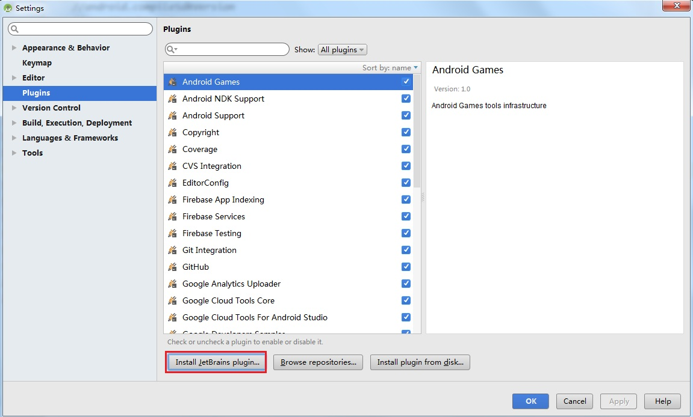
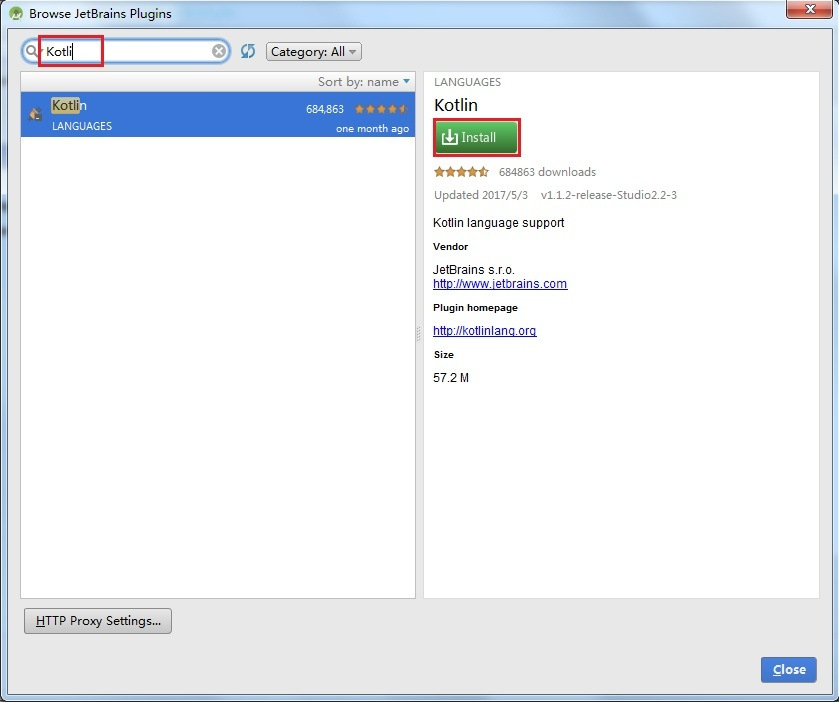

# Kotlin学习笔记-环境搭建
在2017年5月的Google IO大会上，Google宣布Kotlin成为Android的官方语言，随后的2017年6月的TIOBE排行榜中，Kotlin就首次挤进了编程语言TOP50，可见Kotlin的爆发之迅速。作为一个Android开发者需要立刻学习这门新的语言，本文是Kotlin学习笔记的第一篇。

## Kotlin简介

- Kotlin可用于JVM、Android、网页等静态类型编程语言，完全兼容JAVA
- Kotlin来自于捷克的JetBrains公司，IntelliJ IDEA、Android Studio、PyCharm等IDE都出自JetBrains之手。

## 安装Kotlin插件
Android Studio 3.0已经捆绑了Kotlin插件，不需要额外下载。

如果使用的是Android Studio 3.0之前的版本，则需要手动安装Kotlin插件，以下是Kotlin插件安装方法：
- 在Android Studio工程中，依次点击“File”->“Setting”->“Plugins”->“Install JetBrains Plugs”

- 在搜索框中输入“Kotlin”，找到“Kotlin”插件后，点击“Install”按钮进行安装

- 安装完毕后，重启Android Studio

## 项目配置

Project gradle配置：
- 设置Kotlin的版本号，使用最新版本

```
buildscript {
    ext.kotlin_version = "1.1.2"
}
```

Modlue gradle配置：
- Module gradle中添加Kotlin plugin
- Module gradle中添加kotlin gradle插件的路径
- 添加maven的依赖
Module gralde实例如下：

```
apply plugin: 'com.android.application'
apply plugin: 'kotlin-android'
apply plugin: 'kotlin-android-extensions'

buildscript {
    repositories {
        jcenter()
    }
    dependencies {
        classpath "org.jetbrains.kotlin:kotlin-gradle-plugin:$kotlin_version"
    }
}

android {
    compileSdkVersion 25
    buildToolsVersion "25.0.2"

    defaultConfig {
        applicationId "com.cmbc.demo.kotlin"
        minSdkVersion 14
        targetSdkVersion 23
        versionCode 1
        versionName "1.0"
    }
    buildTypes {
        release {
            minifyEnabled false
            proguardFiles getDefaultProguardFile('proguard-android.txt'), 'proguard-rules.pro'
        }
    }
    sourceSets {
        main.java.srcDirs += 'src/main/kotlin'
    }
}

dependencies {
    compile fileTree(dir: 'libs', include: ['*.jar'])
    compile 'com.android.support:appcompat-v7:25.1.1'
    compile "org.jetbrains.kotlin:kotlin-stdlib:$kotlin_version"
}
```

## 转换代码

将Java文件转换为Kotlin文件，转换代码方式：
- 使用快捷键Ctrl+Shift+Alt+K（Windows下）
- 点击菜单“Code”->“CovertJavaFile to Kotlin File”

## 参考文档：

[Kotlin(1)-初探与集成Andorid项目](www.jianshu.com/p/cf1f96c56150)

[为什么我要改用Kotlin](www.blog.csdn.net/androidyue/article/detials/72457157)

[使用Kotlin开发安卓App学习笔记之一](https://baijiahao.baidu.com/po/feed/share?wfr=spider&for=pc&context=%7B%22sourceFrom%22%3A%22bjh%22%2C%22nid%22%3A%22news_4145216357315983769%22%7D)

[Android Studio 使用Kotlin开发Android 入门](https://baijiahao.baidu.com/po/feed/share?wfr=spider&for=pc&context=%7B%22sourceFrom%22%3A%22bjh%22%2C%22nid%22%3A%22news_4410163247779336908%22%7D)
