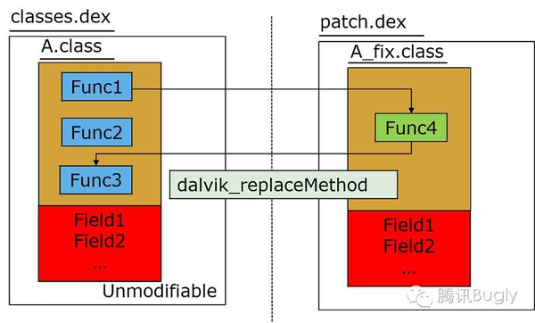
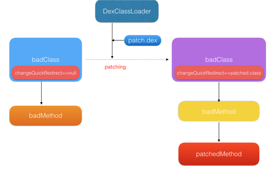
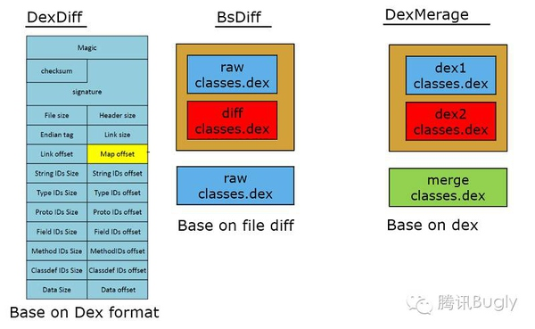

2015年起，Android平台出现了很多热修复方案，从技术原理上主要可以分为：native hook方案、仿Instant Run方案、multidex方案，本文简要说明几种常见的Android热修复技术。
## native hook方案
Native hook方案的原理是
native 动态替换方法 java 层的代码，通过 native 层hook java 层的代码，达到修复bug的目的。该方案的开源框架包括：Dexposed，AndFix等。

### AndFix
AndFix采用native hook的方式，直接使用 dalvik_replaceMethod 替换 class 中方法的实现。

其简要原理如下图所示：

因为是在底层进行hook，所以需要针对dalvik虚拟机和art虚拟机做适配，需要考虑指令集的兼容问题，需要native代码支持，兼容性上会有一定的影响。另外，由于从实现上直接跳过了类初始化，设置为初始化完毕，所以像是静态函数、静态成员、构造函数都会出现问题，复杂点的类Class.forname可能会有问题。

#### 优点：
* 不需要重启
* 轻量 
* 方法级粒度
#### 缺点：
* 方法级别的修复，不能完成资源文件的修改替换
* 由于是调用了JNI层的方法，那么某些ROM可能会有兼容性、稳定性问题。

## 仿Instant Run
2015年底，Android Dev Summit会上，Google高调发布了Android Studio 2.0，其中最重要的新特性Instant Run，实现了对代码修改的实时生效（热插拔）。
### Robust
Robust是美团在

Robust插件对每个产品代码的每个函数都在编译打包阶段自动的插入了一段代码，插入过程对业务开发是完全透明。
Robust为每个class增加了个类型为ChangeQuickRedirect的静态成员，而在每个方法前都插入了使用changeQuickRedirect相关的逻辑，当changeQuickRedirect不为null时，可能会执行到accessDispatch从而替换掉之前老的逻辑，达到fix的目的。

#### 优点：
* 兼容性高
* 实时性好
#### 缺点：
* 侵入产品代码
* 运行效率略差
* 方法数增多，包体积增大

## 基于multidex
基于multidex的热更新框架，包括Nuwa、rocoofix、Tinker等。
技术原理简要来说，就是把多个dex文件塞入到app的classloader之中，但是android dex拆包方案中的类是没有重复的，如果classes.dex和classes1.dex中有重复的类，当用到这个重复的类的时候，需要框架解决。基于Multidex的方案，需要反射更改DexElements，改变Dex的加载顺序，这使得patch需要在下次启动时才能生效，实时性就受到了影响，同时这种方案在android N [speed-profile]编译模式下可能会有问题。

### 微信Tinker
Tinker是微信官方的Android热补丁解决方案，它支持动态下发代码、So库以及资源，让应用能够在不需要重新安装的情况下实现更新。

Tinker 的方案来源 gradle 编译的 instant run 与 buck 编译的 exopackage，核心思想都是全量替换新的 Dex。简言之，就是在编译时通过新旧两个Dex生成差异patch.dex，在运行时，将差异patch.dex重新跟原始安装包的旧Dex还原为新的Dex。

同时Tinker自研了DexDiff算法，可以充分利用原本Dex的信息，减少patch的大小。Tinker的DexDiff粒度是Dex格式的每一项，而BsDiff的粒度是文件，AndFix/Qzone的粒度为class。 
Tinker的diff示意图

#### 优点：
* 支持so替换、资源替换
* 兼容性高
* 非侵入
* 补丁包小
#### 缺点：
* 不能实时生效
* 集成复杂度略高

## 参考资料
[Android热补丁之AndFix原理解析](http://w4lle.github.io/2016/03/03/Android热补丁之AndFix原理解析)

[Alibaba-AndFix Bug热修复框架原理及源码解析](http://blog.csdn.net/qxs965266509/article/details/49816007)

[Android热更新方案Robust](http://tech.meituan.com/android_robust.html)

[微信热补丁 Tinker 的实践演进之路 ](http://dev.qq.com/topic/57ad7a70eaed47bb2699e68e)

[热更新？热补丁？热修复](https://jackl-e-e.github.io/android/2016/05/05/%E7%83%AD%E8%A1%A5%E4%B8%81or%E7%83%AD%E4%BF%AE%E5%A4%8D.html)

[Android hot fix线上热修复框架比较](http://www.voidcn.com/blog/RichieZhu/article/p-5006460.html)

[各大热补丁方案分析和比较]
(http://blog.zhaiyifan.cn/2015/11/20/HotPatchCompare/)

[Android热修复技术方案的选型与验证](http://www.jianshu.com/p/1683c4e6f36d)
